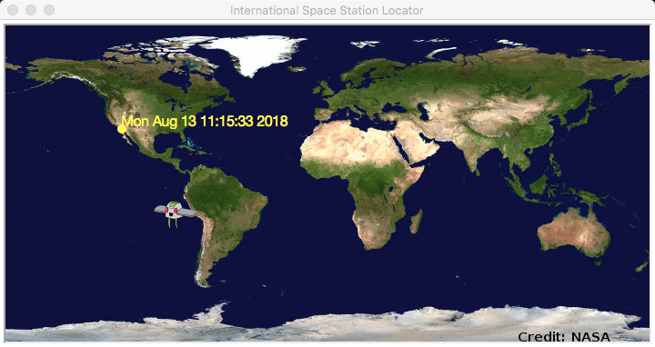

# ISS_Locator

Program that uses the Open-Notify API to retrieve NASA-produced data of the International Space Station and present in a map for the user. Utilizes the Turtle Module to present a Graphical User Interface that the user (in a future addition) may interact with. Also includes HTTP requests and JSON parsing on the retrieved ISS data. Created using Python 3.6.5.

